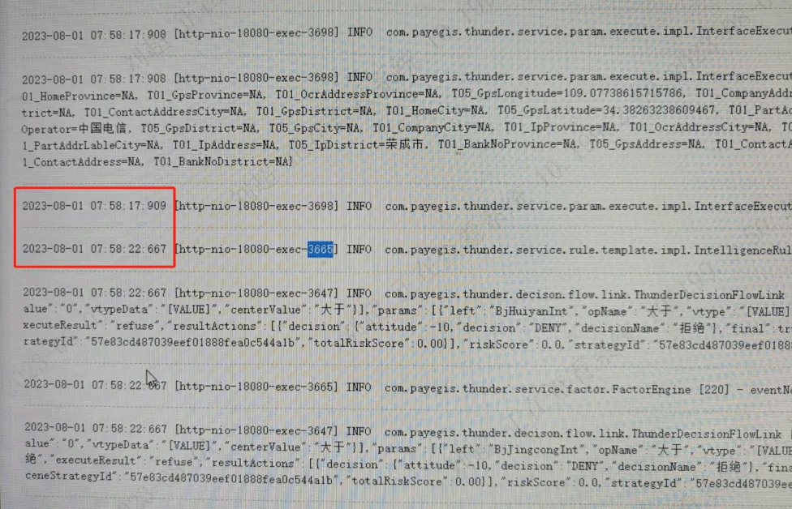
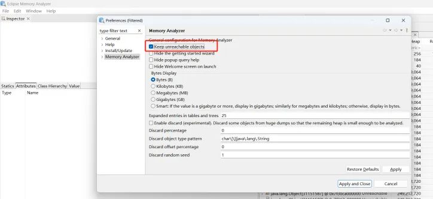
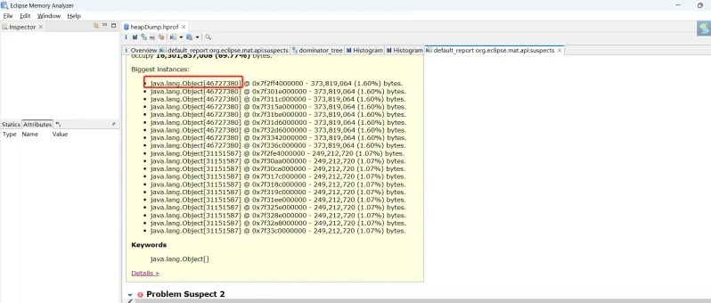
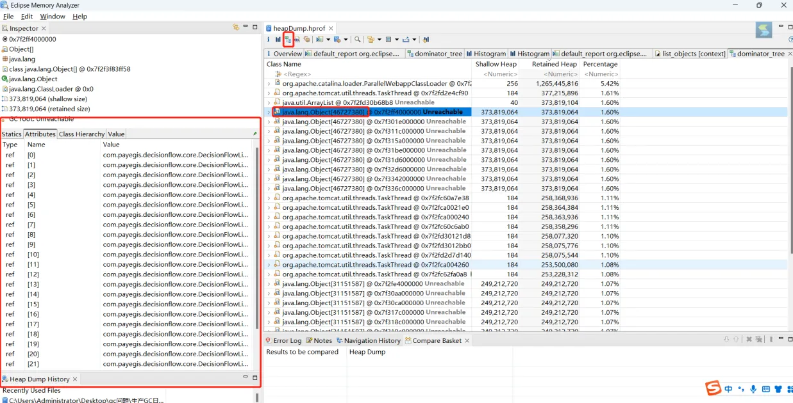

##  想像力比知識更重要

### 背景
早晨8点核心接口上游放量期间，监控发现请求超时率陡增。在进行日志分析发现，服务线程在特定时段出现同步停顿，呈现典型的STW（Stop-The-World）特征。该现象与G1收集器的FullGC行为高度吻合。



### 服务器配置
8C32G，使用G1垃圾收集器，其配置参数为：

```
-XX:MaxGCPauseMillis=250 （期望垃圾收集时间 250ms）
-XX:InitiatingHeapOccupancyPercent=45  （设置G1垃圾收集器进行并发标记周期的阈值）
-XX:G1HeapRegionSize=8M：设置每个G1堆Region的大小
-XX:ConcGCThreads=6  设置并发垃圾收集的线程数
-XX:ParallelGCThreads=4 设置并行垃圾收集的线程数
```


### 问题复现
**Tips**：由于服务本身并没有部署更细致的监控，所以问题的判断只能依靠基于日志的推测及在测试环境复现，这里更加凸显监控服务的重要性

#### 场景复现

测试环境（8C16G）在启动脚本中为服务添加GC日志打印参数：
```
-verbose:gc：启用GC相关的详细输出，包括GC事件和内存统计信息。
-Xloggc: /app/gclog/gc.$$.log :为每个启动线程打印GC日志
-XX:+PrintGCDetails：打印GC的详细信息，包括每次GC的开始时间、持续时间、收集器的名称、已回收的对象等
-XX:+PrintGCDateStamps：将GC相关的日志中的时间戳打印出来
-XX:+PrintGCApplicationStoppedTime：打印GC期间应用程序停止的时间
```


服务发生FullGC前生成内存快照
```
-XX:+PrintHeapAtGC   ：FullGC前生成内存快照
-XX:HeapDumpPath= /app/gclog/$$.heapdump.hprof  ：内存快照文件生成位置
```


提前开启服务监测
jstat -gcutil <pid> 1000  ：每隔一秒打印一次服务垃圾收集相关的统计信息

```
S0     S1     E      O      M     CCS    YGC     YGCT    FGC    FGCT     GCT   
0.00 100.00  69.95  99.96  95.89  92.06   3109  227.757     0    0.000  227.757
0.00 100.00  70.82  99.98  95.89  92.06   3109  227.757     0    0.000  227.757
0.00 100.00  74.11  99.98  95.89  92.06   3109  227.757     0    0.000  227.757
```


接着使用压测工具并发调用问题接口

此时jstat打印已经出现异常，新生代（E）与老年代（O）内存占用率开始同步上升，且老年代内存占用在10秒左右达到94%左右，在发生FullGC之前再未降低

G1内存回收器的老年区使用率增长意味着有对象移入老年区，而G1只有以下情况会将对象分配至老年区:

1. 新生代对象经过多次GC后存活，达到阈值年龄的对象移入老年区
2. Survior区GC后对象存活率超过50%，该区中年龄超过平均值的对象移入老年区
3. 大对象（内存占用超过Region分区的50%）直接分配到老年区


分析/app/gclog/gc.36523.log ，在10秒内进行了8次youngGC和两次MixGC 。同时顺利生成了36523.heapdump.hprof。

使用gzip -6 36523.heapdump.hprof 生成 .zip压缩文件并下载


### 问题分析

#### 初步推测

 

FullGC频繁的情况是生产环境一直就存在的问题，历史发版时就存在服务启动不到1小时就出现一到两次的FullGC，此情况明显不正常,但并未出现什么业务异常，所以并未重视（正常的服务FullGC的频率每天不应超过5次）。

结合此服务日常并发量也就上百，并非大批量导入导出业务，且内存占用并非长时间居高不下，因此，问题应当定位于接口内创建了异常`大对象`,

使用mat打开已下载的内存快照文件

#### 初步调整

在内存快照未分析完之前，首先对G1的核心参数进行调整：

```
-XX:MaxGCPauseMillis=350 调高期望收集时间
-XX:InitiatingHeapOccupancyPercent=35 调低老年代并发标记周期的阈值，期望提前进行垃圾回收
-XX:G1HeapRegionSize=32M：核心调整：当时认为大对象是在数M大小。
因G1将超过单个Region一半内存的对象标记为大对象，单独占用一个Region且存放在老年代，所以期望通过此调整使大对象直接存放在Eden区，通过youngGC可以回收掉。
```

修改之后重启，发现对应用性能提升不大,继续对内存快照进行分析。

 

 

####  内存快照分析 

首先关闭MAT的可回收对象过滤（勾选下图选项），否则会导致可回收但依然占用内存的对象被过滤掉



 

MAT首页已经给出了可能是内存异常的对象 

 



占用内存排行页 可以看到非常清晰的问题：单个集合占用**300M**内存，其中有4千万个元素，且相同类型的集合数量基本与压测请求数量一致，占用内存占总内存比例达70%。可以推测出引起FullGC异常的根源在此处




 3.4、问题解决 

根据上图左侧可以看到集合中对象的类名，经排查是接口内部错误的递归逻辑导致该问题发生。修改代码逻辑后，再次采用并发压测，服务正常。

